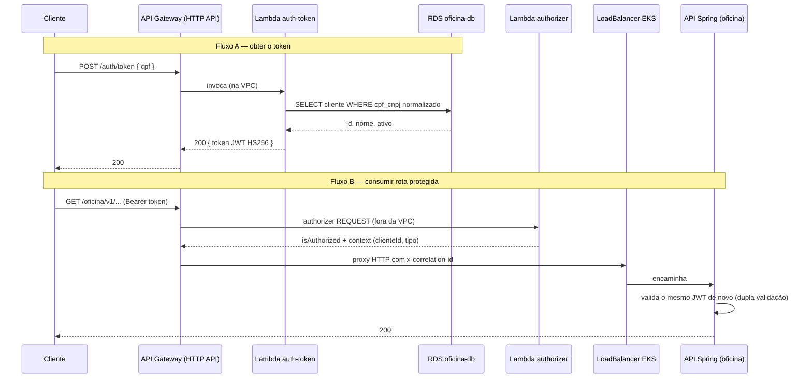

# oficina-lambda

Function serverless de autenticação de clientes por CPF, para o Tech Challenge Fase 3 da
Pós-Tech em Arquitetura de Software (FIAP). Emite o JWT que o cliente final usa para consultar suas
próprias ordens de serviço na API do [`oficina`](https://github.com/rremiao/oficina), sem precisar
de usuário e senha cadastrados como os operadores da oficina.

## Propósito

A API principal (`oficina`) só sabia autenticar operadores, com login por e-mail e senha guardados
na tabela `usuario`. Este componente resolve a outra ponta: o cliente que só tem o CPF cadastrado no
sistema também precisa acessar rotas protegidas. Em vez de criar login para clientes dentro da API,
a troca de CPF por token vira uma function na AWS, desacoplada do deploy da API e escalando de forma
independente dela.

Duas funções compõem o componente:

- **`auth-token`** — recebe o CPF, confirma que o cliente existe e está ativo consultando
  diretamente o RDS `oficina-db`, e devolve um JWT HS256.
- **`authorizer`** — plugado no API Gateway como *Lambda Authorizer*, valida a assinatura e a
  expiração do mesmo JWT em toda requisição a uma rota protegida, antes dela chegar ao
  LoadBalancer da API no EKS.

O desenho completo das decisões e alternativas descartadas está em
[`docs/plano-implementacao-lambda.md`](https://github.com/rremiao/oficina/blob/main/docs/plano-implementacao-lambda.md),
no repositório `oficina`.

## Diagrama



O mesmo segredo HS256 (`security.jwt.secret` na API, `SECURITY_JWT_SECRET` aqui) assina e valida o
token nos três pontos: emissão, authorizer e filtro da API Spring. A dupla validação (Fluxo B) é
intencional — ver [ADR-0001](docs/adr/0001-dupla-validacao-jwt.md).

## Stack

| Camada | Tecnologia |
| --- | --- |
| Runtime | Node.js 22, TypeScript, esbuild (bundle CommonJS) |
| Gateway | AWS API Gateway HTTP API (v2), com Lambda Authorizer `REQUEST` |
| Banco | PostgreSQL (RDS `oficina-db`, provisionado pelo repositório `oficina-database`) |
| JWT | [`jose`](https://github.com/panva/jose), HS256 |
| IaC | Terraform ≥ 1.5, backend S3 |
| CI/CD | GitHub Actions |
| Testes | Vitest |

## Pré-requisitos

- Node.js 22 e `npm`.
- Terraform ≥ 1.5.0 e a CLI da AWS configurada com as credenciais temporárias do AWS Academy
  Learner Lab (`aws sts get-caller-identity` precisa responder antes de qualquer `apply`).
- Um bucket S3 versionado para o state remoto (criado uma única vez, manualmente — ver
  `docs/plano-implementacao-lambda.md`, Fase 00).
- O RDS `oficina-db` e o Service `LoadBalancer` da API já publicados pelos repositórios
  `oficina-database` e `oficina-kubernetes`.
- O mesmo valor de `security.jwt.secret` usado pela API Spring, com pelo menos 32 caracteres.

## Rodando localmente

```bash
npm ci
npm run lint    # tsc --noEmit
npm test        # vitest run
npm run build   # gera dist/ e function.zip
```

Os testes não tocam em nenhum recurso da AWS: o banco e o relógio são simulados. Não é preciso
Docker nem credenciais para rodar `npm test`.

### Testes de integração (Postgres real, sem AWS)

Exercitam o handler `token.ts` contra um PostgreSQL de verdade — conexão real, consulta com o
índice funcional de `cpf_cnpj` e verificação da assinatura do JWT. Precisam de Docker; não usam
nenhum recurso da AWS.

```bash
npm run it:up            # sobe o Postgres (docker-compose.integration.yml) e espera ficar saudável
npm run test:integration # vitest run --config vitest.integration.config.ts
npm run it:down          # derruba o container e apaga o volume
```

A tabela `cliente` e os registros de exemplo vêm de `tests/integration/schema.sql` (um cliente
ativo cadastrado com máscara, um inativo sem máscara). Os casos cobrem `200` + claims do token,
`404`, `403` (inativo) e `400` (CPF inválido). Estes testes **não** rodam no `npm test` — o sufixo
`.integration.ts` fica fora do glob padrão do Vitest.

## Contrato da rota `POST /auth/token`

| Código | Situação |
| --- | --- |
| `200` | CPF válido, cliente existe e está ativo — devolve `{ token, tipo, expiraEm, cliente }` |
| `400` | CPF ausente, malformado ou com dígito verificador inválido |
| `404` | CPF válido, mas sem cliente correspondente |
| `403` | Cliente existe com `ativo = false` |
| `503` | Banco indisponível ou timeout de conexão |

A collection Postman em [`docs/postman/`](docs/postman) cobre os quatro cenários acima, mais uma
chamada a uma rota protegida com o token recém-emitido.

## Deploy

O deploy é sempre feito pela pipeline (`.github/workflows/deploy.yml`), nunca manualmente: um push
em `homolog` aplica o ambiente `hml`, um push em `main` aplica o ambiente `prd`. Antes do primeiro
deploy em um ambiente nunca aplicado:

1. Preencher `infra/envs/hml.tfvars` (ou `prd.tfvars`) com o DNS real do LoadBalancer da API —
   o valor de exemplo (`SUBSTITUIR-...`) faz a pipeline falhar de propósito, para não aplicar um
   `$default` route apontando para lugar nenhum.
2. Configurar no repositório GitHub:
   - Secrets: `AWS_ACCESS_KEY_ID`, `AWS_SECRET_ACCESS_KEY`, `AWS_SESSION_TOKEN` (do Learner Lab),
     `DB_PASSWORD` e `SECURITY_JWT_SECRET` (idêntico ao da API).
   - Variáveis: `TF_STATE_BUCKET` (bucket do state) e, opcionalmente, `SMOKE_CPF` (um CPF de
     cliente ativo de teste, para o smoke test pós-deploy).
3. Proteger as branches `main` e `homolog` exigindo Pull Request e os checks de `ci.yml`.

Para rodar `plan`/`apply` manualmente (depuração local):

```bash
cd infra
terraform init \
  -backend-config="bucket=<bucket-do-state>" \
  -backend-config="key=oficina-lambda/hml/terraform.tfstate" \
  -backend-config="region=us-east-1"

TF_VAR_db_password=... TF_VAR_jwt_secret=... \
  terraform plan -var-file=envs/hml.tfvars
```

## Pipelines

- **`ci.yml`** (Pull Request para `main`/`homolog`) — instala dependências, roda `tsc --noEmit`,
  `vitest`, empacota o `function.zip` e confere que os dois handlers estão dentro dele. Em seguida
  valida o Terraform (`fmt -check`, `validate`) e, só quando há credenciais AWS e a variável
  `TF_STATE_BUCKET` configuradas no repositório, publica um `terraform plan` no resumo do job. Sem
  credenciais (comuns no Learner Lab, que expiram cedo), o `plan` é pulado sem quebrar o PR.
- **`deploy.yml`** (push em `main`/`homolog`) — roda os testes de novo, builda o pacote, valida as
  credenciais AWS, recusa aplicar se o `.tfvars` do ambiente ainda tiver o valor de exemplo, aplica
  o Terraform e roda um smoke test: emite um token para `SMOKE_CPF` e confere que ele é aceito numa
  rota protegida. Um `concurrency` por ambiente impede dois `apply` simultâneos no mesmo state.

## Segurança e observabilidade

- Logs em JSON (`src/infra/logger.ts`), com `timestamp`, `level`, `service`, `correlationId` e
  `evento` em cada linha. O CPF nunca aparece em claro — só um hash truncado
  (`digitalDoCpf`). O `correlationId` é herdado do cabeçalho `x-correlation-id` quando presente, e
  segue do Gateway até o log da API no EKS (ver `CorrelationIdFilter` no repositório `oficina`).
- Alarmes no CloudWatch (`infra/observability.tf`) para erro de execução, `p95` de duração,
  estrangulamento por concorrência reservada e 5xx no Gateway.
## Decisões arquiteturais

### RFCs — `docs/rfc/`

| # | Assunto |
| --- | --- |
| [RFC-0001](docs/rfc/0001-autenticacao-por-cpf.md) | Autenticação de clientes por CPF com JWT HS256 compartilhado |
| [RFC-0002](docs/rfc/0002-escolha-do-api-gateway.md) | Escolha do API Gateway: AWS API Gateway HTTP API (v2) |
| [RFC-0003](docs/rfc/0003-runtime-e-empacotamento-da-function.md) | Runtime e empacotamento: Node.js 22 + esbuild |
| [RFC-0004](docs/rfc/0004-observabilidade-da-function.md) | Observabilidade: CloudWatch Logs, métricas e alarmes |

### ADRs — `docs/adr/`

| # | Decisão |
| --- | --- |
| [ADR-0001](docs/adr/0001-dupla-validacao-jwt.md) | Validar o JWT no Lambda Authorizer e no filtro da API Spring |
| [ADR-0002](docs/adr/0002-comunicacao-sincrona-via-api-gateway.md) | Comunicação síncrona HTTP via API Gateway, sem mensageria |
| [ADR-0003](docs/adr/0003-logs-estruturados-e-correlacao.md) | Organização dos logs e da correlação de requisições |
| [ADR-0004](docs/adr/0004-escalabilidade-concorrencia-reservada.md) | Escalabilidade: concorrência reservada e conexão reaproveitada |
| [ADR-0005](docs/adr/0005-segredos-em-variaveis-de-ambiente.md) | Segredos em variáveis de ambiente da Lambda, não no Secrets Manager |
| [ADR-0006](docs/adr/0006-isolamento-de-rede.md) | Isolamento de rede: `auth-token` na VPC, `authorizer` fora |
